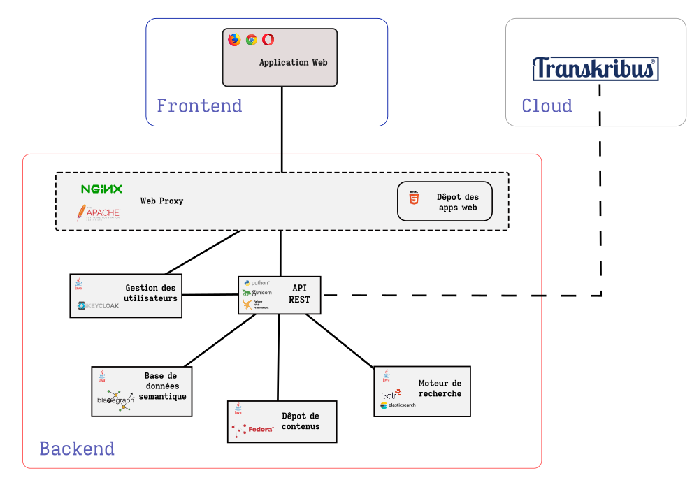
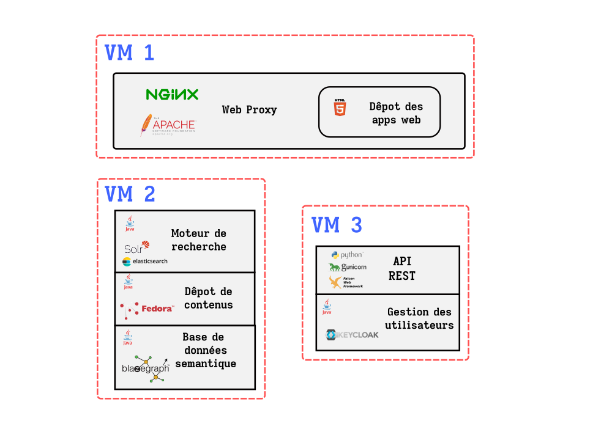

# Historic Document Repository System (HDRS)

This repository contains the code (mostly in python) for a proof of concept of a Historic Document Repository System, formulated in the context of the project *Nouvelle France Numérique*. 

